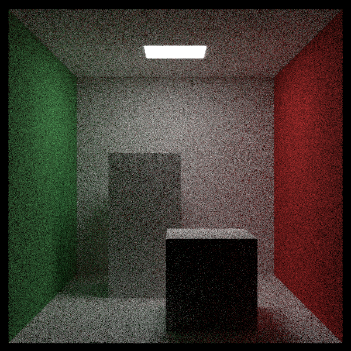
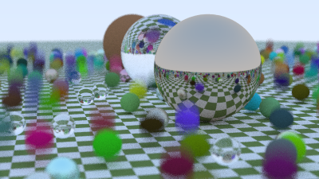
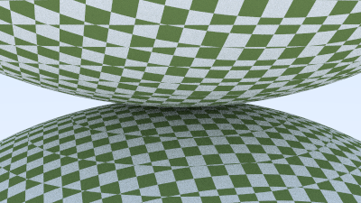
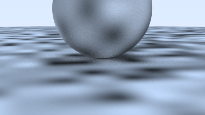
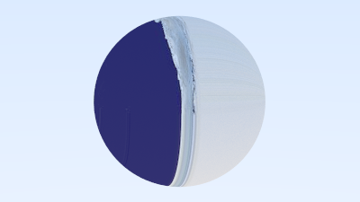
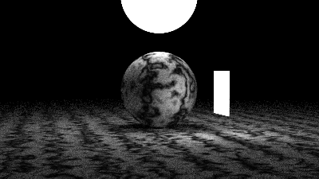
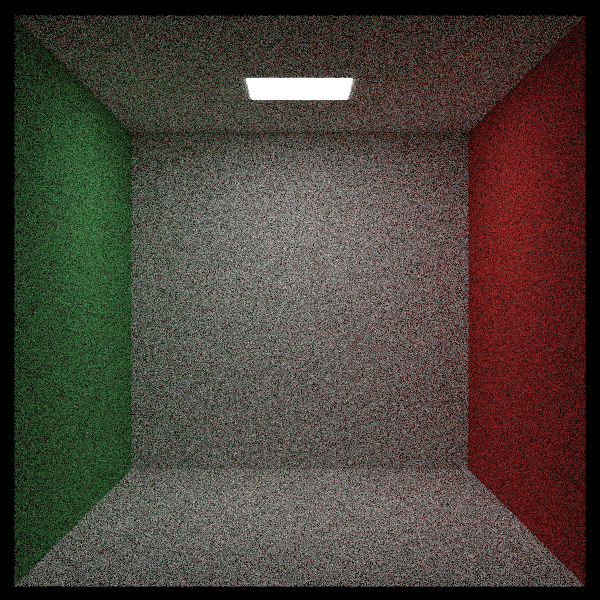
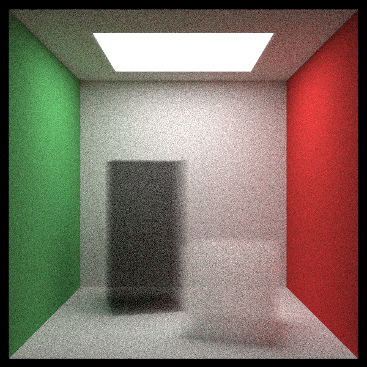

# RayTracing-TheNextWeek
[Ray Tracing: The Next Week](https://raytracing.github.io/books/RayTracingTheNextWeek.html)([日本語版](https://inzkyk.xyz/ray_tracing_in_one_weekend/))を学んでいる記録

wip:

---

random scene:

---

two spheres:

---

two perlin spheres:

---

earth:

---

simple light:

---

Cornell box:

---

🆕 Cornell box with blocks of smoke:

---

## 時空間
- 日：シャッターの開閉時間 -> 開閉時刻
- 日：`moving_sphere.h`に条件つきコンパイルの部分が無い

## テクスチャ
- 日：英語版には無い`main.cc`のlambertianマテリアルの書き換えについて記載

## パーリンノイズ
- `ranfloat`に予め生成した乱数列を格納
- noise関数ではpoint3から特定の操作を施して疑似ノイズを生成する
    - (最初の実装)
        - x,y,z要素それぞれ4倍し、下7bitをとる
        - x,y,z要素でXORを取り、予め生成されている`ranfloat`にアクセス
- permute(int* p, int i)関数は前半i個の要素をかき混ぜる
- perlin_generate_permは0--(point_count-1)のインデックスをかき混ぜる

- 補完してそれっぽいノイズを作る

## 画像テクスチャ
- 画像のピクセル数が変わっても対応できるように、テクスチャ座標(u,v)と画像のピクセル値(i,j)を対応付ける。
- テクスチャが無い場合は特定の色を返す。Unityならピンク、今回はシアン。

- 日：`rtw_stb_image.h`の記述無し